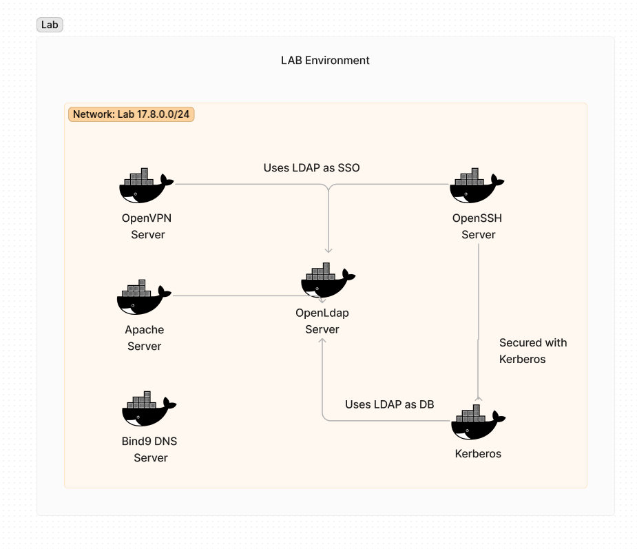

# Overview

The project is a containerized LDAP SSO Project with different services and a DNS server and a kerberos server.

The chosen technologies where docker for the ease of the usage and to fasten the cycle of the development due to the shortage of time. However, we want to disclaim that all the configuration were done by hand, only in the openldap server where we used a ready to use docker image.

The lab has the following structure:




The different services use LDAP as a database and Identity provider. We will go through the configuration of each service step by step in order

## Networking

To setup this lab a dedicated network was created in docker with the ip of `17.8.0.0/24` The network allows control of the IP addressess of the container and the network as a whole.

## OpenLDAP

To configure thepam_mkhomedir.so OpenLDAP we refer to this docker section:

```yaml
  openldap:
    image: osixia/openldap
    ports:
      - 389:389
      - 636:636
    env_file: ./ldap.env
    healthcheck:
      test: "[ -e /run/slapd/slapd.pid ] || exit 1"
      interval: 30s
      timeout: 30s
      retries: 100
    volumes:
      - ./ldap/certs:/container/service/slapd/assets/certs
      # - ./seeders:/container/service/slapd/assets/config/bootstrap/ldif/custom
      - type: bind
        source: /dev/urandom
        target: /dev/urandom
        read_only: true

      - type: bind
        source: /etc/timezone
        target: /etc/timezone
        read_only: true

      - type: bind
        source: /etc/localtime
        target: /etc/localtime
        read_only: true

      - type: bind
        source: ./ldifs
        target: /container/service/slapd/assets/config/bootstrap/ldif/custom
        read_only: true
```

The docker image has two exposed ports which are

- `389` The unsecure LDAP Port
- `636` The Ldaps port with TLS connection


To setup OpenLDAP we need to defined a few things:

- `LDAP_DOMAIN` The domain of our OpenLDAP server which will be under the form of `example.com`.
- `LDAP_CONFIG_PASSWORD` The password to change the configuration of the server and to be precise `cn=config`
- `LDAP_ADMIN_DN` The password  for the admin of the LDAP server "cn=admin,dc=acme,dc=org".
- `LDAP_TLS_CA_CRT_FILENAME` We should pass the TLS CA Certificate when we have a self signed certificate.
- `LDAP_TLS_KEY_FILENAME` This is the key of our certificate.
- `LDAP_TLS_CRT_FILENAME` This the file of the certificate
- `LDAP_TLS_VERIFY_CLIENT` With this variable we can either enforce the TLS Connection or make it `try` where it will be dropped on failure and switched back to normal TCP one
- `LDAP_READONLY_USER` The readonly user that will be used by most services


We are binding the `/etc/localtime` and `/etc/timezone` to make sure the container has the same time as the host. That will be needed later to hook the kerberos server


### Generating Certificates

To generate certificates we used the `easyrsa` command as it offered a simple way of creating a PKI infrastructure, generating server and client certificates on the fly

```shell
easyrsa initpki
easyrsa gen-dhA
easyrsa gen-req client meow
easyrsa sign-req meow
```


To able to manage ldap server on the fly we added an LDAPAdmin server.

The server contains a ldap-user-manager of wheelybird which an application that help adding and removing user. The thing here that was not enough as we wanted to modify ACLs, users and groups.

To configure the openLDAP server we should pass the password  and DN of the admin user, the server URL which is the LDAPS in our case and define some simple informations as the name of the `OU` that will represents the users (`users` or `people`).

```yml
ldap_admin:
    image: wheelybird/ldap-user-manager
    environment:
      - LDAP_IGNORE_CERT_ERRORS=true
      - LDAP_URI=ldaps://openldap:636
      - LDAP_REQUIRE_STARTTLS=TRUE
      - LDAP_BASE_DN=dc=acme,dc=org
      - LDAP_ADMIN_BIND_DN=cn=admin,dc=acme,dc=org
      - LDAP_ADMIN_BIND_PWD=admin
      - LDAP_USER_OU=users
      - LDAP_ADMINS_GROUP=admin
    ports:
      - 3000:443
    networks:
      - lab
```

> We didn't use the LDAP admin interface to configure the app, we actually wrote the LDIFs file that will be added on the server init.

The Ldifs create the `OU`s, the groups and add members. Also they define the ACLs for each group/OU.

At later stage we added ldif files that will add the kerberos schema and prepare the OpenLDAP server to integrate with the kerberos one.


## OpenSSH Server

The openSSH server was configured from scratch as it was simple ( well that's what we thought at the start ). We are using Secure `TLS` connection between the `OpenSSH` and the `OpenLDAP``. 

```yaml
  ssh-container:
    build:
      dockerfile: Dockerfile
      context: ./ssh-container
    depends_on:
      openldap:
        condition: service_healthy
    ports:
      - "2222:22"
    networks:
      - lab
  openvpn:
    build:
      context: ./openvpn-config
    depends_on:
      - openldap
    volumes:
      - ./openvpn-config/logs/:/var/log/openvpn
    env_file: ./openvpn.env
    ports:
      - 1194:1194/udp
    cap_add:
      - "NET_ADMIN"
    environment:
      - DEBUG=1
    networks:
      - lab
  apache-server:
    depends_on:
      openldap:
        condition: service_healthy
    build:
      context: ./apache-config
      dockerfile: Dockerfile
    env_file: ./apache.env
    ports:
      - 5200:80
    networks:
      - lab
```


To configure the OpenSSH to authenticate with OpenLDAP we needed the followings:

- A specific group that has access to the SSH service.
- Users of that group having the `posixAccount` attribute and having some specific attributes that will be used by OpenSSH server to determine the user's `uid`, `guid`, home directory, and `shell`


For the configuration, we opted for OpenSSH with `SSSD` as it offered a way to facilitate the server configuration for bother kerberos and OpenLDAP. 

It was quite painful as we had to configure many parts of it

1. Define the OpenLDAP server connection in `libnss-ldap.conf`

2. In the `SSSD.conf`, we will define how the authentication will be handled, which users will be accepted

Another interesting part of the configuration is that users that don't exist on the local machine won't be allowed to connect as the machine don't have their informations.

We can add `pam_mkhomedir.so` plugin to the PAM service so that it creates the user group and home directory on first login!

## Apache Server

For the apache server the configuration was quite straight-forward.

We install the `authnz_ldap` plugin, then we create an apache configuration file that contains the following:

```conf
LDAPTrustedGlobalCert CERT_BASE64 /certs/ldap_server.crt
LDAPTrustedGlobalCert KEY_BASE64 /certs/ldap_server.key
LDAPTrustedGlobalCert CA_BASE64 /certs/ldap_server.crt
LDAPVerifyServerCert Off

<VirtualHost *:80>
  DocumentRoot /var/www/html

  ErrorLog ${APACHE_LOG_DIR}/error.log
  CustomLog ${APACHE_LOG_DIR}/access.log combined

  <Location /secure.php>
    Order allow,deny
    Allow from all

    AuthBasicProvider ldap
    AuthType Basic
    AuthName "This page is restricted to some vip members"

    AuthLDAPURL ${LDAP_URL}/OU=users,DC=acme,DC=org?uid
    AuthLDAPBindDN  ${LDAP_BIND_DN}
    AuthLDAPBindPassword ${LDAP_BIND_PW}

    AuthLDAPGroupAttribute member
    require ldap-group CN=WebAccess,OU=groups,DC=acme,dc=org
    AuthLDAPGroupAttributeIsDN On

</Location>
</VirtualHost>
```

As you can see, we define the authentication method as LDAP, the group that has access to the service and more informations needed for the connection to the service.

## OpenVPN

The `OpenVPN` configuration was quite complex as we couldn't find a plugin that will allow the TLS connection with a self signed certificate. We even tried to bring an old plugin to life with modifying its code and re-packaging it but it took hours to realized what we are trying to do needs more expertise.


To configure the OpenVPN server

1. We generated certificates for the server
2. We created the server.conf as the following

```conf
proto udp
dev tun
server 10.8.0.0 255.255.255.0
# ifconfig-pool-persist ipp.txt
# push "redirect-gateway def1 bypass-dhcp"
# push "dhcp-option DNS ${DNS_SERVER1}"
# push "dhcp-option DNS ${DNS_SERVER2}"
duplicate-cn
keepalive 10 120
cipher AES-256-GCM
ca /certs/ca.crt
cert /certs/vpnserver.crt
key /certs/vpnserver.key
dh /certs/dh.pem
persist-tun
ncp-ciphers AES-256-GCM:AES-256-CBC
auth SHA512
persist-key
persist-tun
status openvpn-status.log
verb 5
tls-server
tls-version-min 1.2
# crl-verify /etc/openvpn/crl.pem
 
plugin /usr/lib/openvpn/openvpn-auth-ldap.so /etc/openvpn/auth/ldap-auth.conf
verify-client-cert optional

# script-security 2
# route-up  /etc/openvpn/fix-routes.sh

log /var/log/openvpn/openvpn.log

```

We defined the plugin that will help us achieve the openvpn ldap authentication and we have defined its attribute in another file called ldap.conf

```conf

<LDAP>
	# LDAP server URL
	URL		ldap://openldap:389
	# Network timeout (in seconds)
	Timeout		15
	# Enable Start TLS
	TLSEnable	false
	# Follow LDAP Referrals (anonymously)
	 FollowReferrals no
	# TLS CA Certificate File
	TLSCACertFile	/certs/ldap_server.crt
	# TLS CA Certificate Directory
	#TLSCACertDir	/certs
	# Client Certificate and key
	# If TLS client authentication is required
	#	TLSCertFile	/certs/ldap_server.crt
	#	TLSKeyFile	/certs/ldap_server.key

</LDAP>

<Authorization>
	# Base DN
	BaseDN		"OU=users,DC=acme,DC=org"
	# User Search Filter
	SearchFilter	"(&(uid=%u)(objectClass=posixAccount))"
	# Require Group Membership
	RequireGroup	true
	# Add non-group members to a PF table (disabled)
	#PFTable	ips_vpn_users
	# Uncomment and set to true to support OpenVPN Challenge/Response
	#PasswordIsCR	false
	<Group>
		# Default is true. Match full user DN if true, uid only if false.
		RFC2307bis   true

		# Default is true. Uncomment and set to false if you want to use a Search operation to determine group
		# membership instead of Compare. Lower performance, so Compare should generally be used, but Search is
		# required in certain LDAP environments.
		# UseCompareOperation   true

		BaseDN		"OU=groups,DC=acme,DC=org"
		SearchFilter	"(|(cn=vpnAccess))"
		MemberAttribute	member
		# Add group members to a PF table (disabled)
		#PFTable	ips_vpn_eng
	</Group>
</Authorization>
```

However the plugin does not allow self signed certificate as they will be revoked on the server. After a lot of trial and error we decided to drop it and make it normal TCP connection.

For the client configuration we have the following

```conf
client
dev tun
proto udp
resolv-retry infinite
nobind
persist-key
persist-tun
cipher AES-256-GCM
auth SHA512
verb 3
tls-client
tls-version-min 1.2
key-direction 1
remote-cert-tls server
auth-user-pass
 
remote localhost 1194
ca ./certs/ca.crt
cert ./certs/client.crt
key ./certs/client.key
```

We are defining the client certificates the self signed CA certificate and we added the authentication method to be `auth-user-pass` which means we will be prompted for username and password.

## DNS server 

- The DNS server was quite easy, we passed the server configuration which will define the listening ports and the forwarders.

- We defined our zone which `lab.lan` which will contain the DNS records of the different containers we have
- Finally, we had the zones configurations where we define the containers different records

```conf
$TTL 1d ; default expiration time (in seconds) of all RRs without their own TTL value
@    IN  SOA  ns1.lab.lan. root.lab.lan. (
                 3      ; Serial
                 1d;    ; Refresh
                 1h;    ; Retry
                 1w;    ; Expire
                 1h);   ; Negative Cache TTL

; Name servers - NS records
@    IN  NS  ns1.lab.lan.;

; Name servers - A records
ns1.lab.lan.        IN  A  dns-server.lab.lan
openldap.lab.lan.   IN  A  openldap.lab.lan

; Uncomment when done configuring these
;openvpn.lab.lan.    IN  A  openvpn
;apache.lab.lan.     IN  A  apache
```

## Kerberos Server configuration

The kerberos configuration was the trickiest one as we needed to setup the LDAP server so the kerberos service can work with it.

We modified our LDIFs to have the kerberos schema definition at the start. 

For it we have used a magic script that will configure the server

1. Create the kerberos REALM
2. Create a keyfile 
3. We create a keyfile that will help us connect to the OpenLDAP server. The KDC needs two users, the admin one to write entries and mofiy ACLs and the readonly user to read entries
4. Then we will generate the configuration file `/etc/krb5.conf`. This configuration file will contain the definition of our REALM, as the encryption method, the port, the database module and kdc server
5. Then we will configure the KDC to allow access to the OpenLDAP service as it will need to view users' passwords and add tickets and services

6. At the end we start our kerberos service as the kadmin daemon.

```shell

#!/bin/bash

if [ ! -f /kerberos_initialized ]; then

echo "==================================================================================="
echo "==== Kadmin and Realm ============================================================="
echo "==================================================================================="
KADMIN_PRINCIPAL_FULL=$KADMIN_PRINCIPAL@$REALM
echo "KADMIN_PRINCIPAL_FULL: $KADMIN_PRINCIPAL_FULL"
echo "REALM: $REALM"
echo ""

echo "==================================================================================="
echo "==== Creating REALM in LDAP and local ============================================="
echo "==================================================================================="
if [ ! -f /etc/krb5kdc/.k5.${REALM} ]; 
then
	MASTER_PASSWORD=$(tr -cd '[:alnum:]' < /dev/urandom | fold -w30 | head -n1)
	kdb5_ldap_util -D ${LDAP_KADMIND_DN} -w ${LDAP_KADMIND_DN_PASSWORD} -H ${LDAP_SERVER} -r ${REALM} create -subtrees ${LDAP_BASE_DN} -k ${ENCRYPTION_TYPE} -M "K/M" -P ${MASTER_PASSWORD} -s -containerref ${LDAP_KERBEROS_CONTAINER_DN} <<< ${LDAP_KERBEROS_CONTAINER_DN}
	echo ""
else
	echo "REALM ${REALM} is existed in LDAP and local"
	echo ""
fi

echo "==================================================================================="
echo "==== Create keyfile for auto enter in LDAP (/service.keyfile) ====================="
echo "==================================================================================="
echo "DN for write/read is ${LDAP_KADMIND_DN}"
kdb5_ldap_util -D ${LDAP_KADMIND_DN} -w ${LDAP_KADMIND_DN_PASSWORD} -H ${LDAP_SERVER} -r ${REALM} stashsrvpw -f /service.keyfile ${LDAP_KADMIND_DN} <<EOF
${LDAP_KADMIND_DN_PASSWORD}
${LDAP_KADMIND_DN_PASSWORD}
EOF
echo ""

echo "DN for read is ${LDAP_KDC_DN}"
kdb5_ldap_util -D ${LDAP_KADMIND_DN} -w ${LDAP_KADMIND_DN_PASSWORD} -H ${LDAP_SERVER} -r ${REALM} stashsrvpw -f /service.keyfile ${LDAP_KDC_DN} <<EOF
${LDAP_KDC_DN_PASSWORD}
${LDAP_KDC_DN_PASSWORD}
EOF
echo ""

echo "==================================================================================="
echo "==== /etc/krb5.conf ==============================================================="
echo "==================================================================================="
KDC_KADMIN_SERVER=$(hostname -f)
tee /etc/krb5.conf <<EOF
[kdcdefaults]
    kdc_ports = $PORTS
	kdc_tcp_ports = $PORTS
	kadmind_port = $KADMIN_PORT
[libdefaults]
	default_realm = $REALM
	dns_lookup_realm = false
	dns_lookup_kdc = false
	ticket_lifetime = 24h
	renew_lifetime = 7d
	forwardable = true
	spake_preauth_groups = edwards25519
[realms]
	$REALM = {
		kdc_ports = $PORTS
		kdc_tcp_ports = $PORTS
		kadmind_port = $KADMIN_PORT
		kdc = $KDC_KADMIN_SERVER
		admin_server = $KDC_KADMIN_SERVER
		default_domain = $KDC_KADMIN_SERVER
		database_module = openldap_ldapconf
	}
EOF
echo ""

echo "==================================================================================="
echo "==== /etc/krb5kdc/kdc.conf ========================================================"
echo "==================================================================================="
tee /etc/krb5kdc/kdc.conf <<EOF
[realms]
	$REALM = {
		max_life = 12h 0m 0s
		acl_file = /etc/krb5kdc/kadm5.acl
		max_renewable_life = 7d 0h 0m 0s
		master_key_type = aes256-cts
		supported_enctypes = $SUPPORTED_ENCRYPTION_TYPES
		default_principal_flags = +preauth
	}
[dbdefaults]
	ldap_kerberos_container_dn = $LDAP_KERBEROS_CONTAINER_DN
[dbmodules]
    openldap_ldapconf = {
		db_library = kldap

		# if either of these is false, then the ldap_kdc_dn needs to
		# have write access
		disable_last_success = true
		disable_lockout  = true

        # this object needs to have read rights on
        # the realm container, principal container and realm sub-trees
		ldap_kdc_dn = "$LDAP_KDC_DN"

        # this object needs to have read and write rights on
        # the realm container, principal container and realm sub-trees
		ldap_kadmind_dn = "$LDAP_KADMIND_DN"

        ldap_service_password_file = /service.keyfile
        ldap_servers = $LDAP_SERVER
		ldap_conns_per_server = 5
    }
[logging]
	default = STDERR
	kdc = STDERR
	admin_server = STDERR
EOF
echo ""

echo "==================================================================================="
echo "==== /etc/krb5kdc/kadm5.acl ======================================================="
echo "==================================================================================="
tee /etc/krb5kdc/kadm5.acl <<EOF
$KADMIN_PRINCIPAL_FULL *
EOF
echo ""

echo "==================================================================================="
echo "==== Change password $KADMIN_PRINCIPAL_FULL ============================================="
echo "==================================================================================="
kadmin.local -q "change_password -pw $LDAP_KADMIND_DN_PASSWORD $KADMIN_PRINCIPAL_FULL"
echo ""

echo "==================================================================================="
echo "==== Run the services ============================================================="
echo "==================================================================================="
# We want the container to keep running until we explicitly kill it.
# So the last command cannot immediately exit. See
#   https://docs.docker.com/engine/reference/run/#detached-vs-foreground
# for a better explanation.

touch /kerberos_initialized
fi

echo "==================================================================================="
echo "==== Start KDC ===================================================================="
echo "==================================================================================="

krb5kdc -P /krb5kdc.pid
kadmind -nofork

```